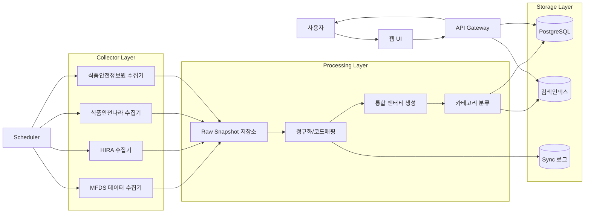
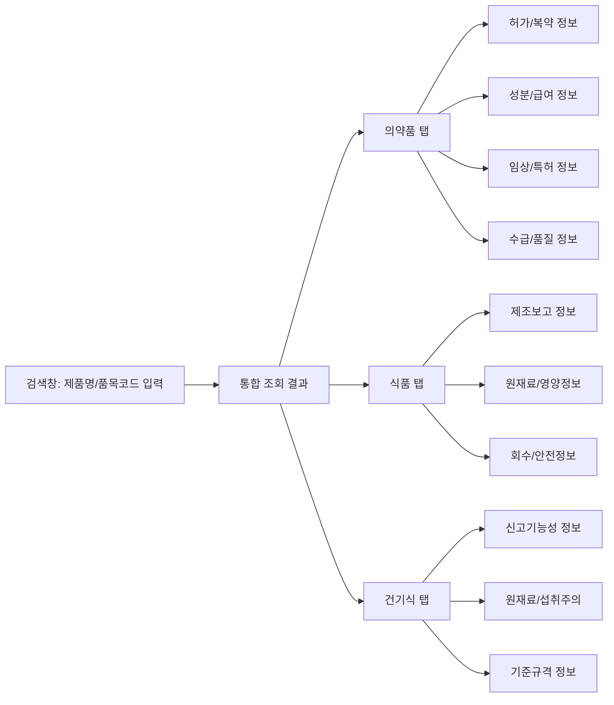
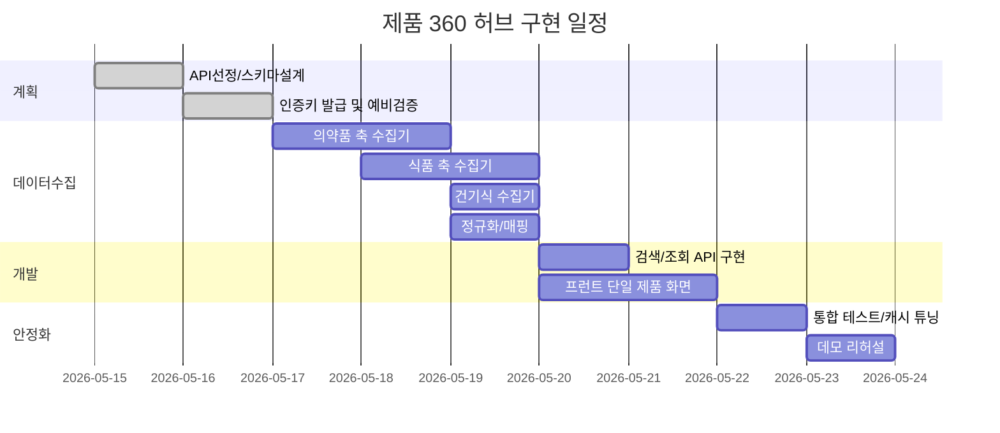

# 공공 식의약 제품 통합 조회 해커톤 제안서

**Executive Summary.** 본 제안서는 공공데이터포털과 MFDS 식의약 데이터포털(OPCAA01F01), 건강보험심사평가원(HIRA), 식품안전처·식품안전나라, 식품안전정보원이 공개한 의약품·의약외품·식품 관련 API를 **“동일 제품 기준 통합 조회 플랫폼”**으로 묶어 제안한다. 의약품에서는 **‘품목기준코드 → 대표 제품/일반명/ATC’** 축이, 식품에서는 **‘품목제조번호(또는 인허가번호) → 원재료/영양/회수’** 축이 연결고리이며, 이를 한 화면에서 카테고리별 탭으로 제공하는 **Product 360** 모델이 실무자 요구에 부합한다. 핵심 구동 로직은 OPCAA01F01 검색 페이지로 공식 API를 검증하고, 배치 수집된 데이터를 정규화하여 품목별 통합 뷰를 제공하는 것이다. 다만 MFDS API의 변경 이력이 있고, 공공데이터포털/HIRA는 하루 호출 제한이 있으므로 **캐시 + 정규화 + 검색인덱스 아키텍처**로 설계하는 것이 필수다. 

## 조사 범위와 통합 원칙

이번 보고서는 공공데이터포털, MFDS(OPCAA01F01) 공식문서, HIRA 공식 문서, 식품안전처·식품안전나라 공식 문서, 식품안전정보원 자료를 우선 분석했다. 각 API의 **최신 업데이트일**은 공식 문서의 “최종수정일”을 기준하며, 확인 불가한 경우 ‘미확인’으로 표기했다. (예: 위생용품 원재료 API 최종수정일은 문서 확인 불가로 ‘미확인’) ([data.go.kr](https://www.data.go.kr/data/15095677/openapi.do)).

핵심은 “같은 제품”의 정의다. 의약품의 경우 식약처 API는 `품목기준코드`를, HIRA는 `일반명코드/제품코드/ATC`를 키로 삼는다. 식품은 식약처 `인허가번호`/`품목제조번호`가, 건강기능식품은 `품목제조번호`와 `원료인정번호`가 중심이다. 따라서 전 영역에서 **공통 키를 억지로 합치기보다**, 각 도메인별 기본키를 유지한 `canonical_id`로 정규화하고 필요한 경우 코드를 연결하도록 한다. 예를 들어, 의약품은 식약처 대표품목에서 HIRA 코드를 얻어 조인하고, 식품은 제조보고번호로 원재료/영양/회수를 잇는 식이다. 이렇게 하면 개발·품질·영업용 실제 사용 시 “정확 일치 vs 유사군” 전환이 용이하다.

아울러 MFDS 포털(OPCAA01F01)은 **메타검색용**이다. 즉, OPCAA01F01은 공공데이터포털의 식의약 API 카탈로그를 제공하므로, “서비스명·제공기관·형식·제한”을 검증할 때 사용하고, 실제 API 호출은 data.go.kr·식품안전나라 링크에서 수행해야 한다. 특히 MFDS 계열 API는 버전 변경 공지가 종종 있으므로, **중간 어댑터 레이어와 캐시 기반 설계**가 필수다.

## 통합 대상 API 목록

아래 표는 **통합 대상으로 선별한 주요 API** 목록이다. 서비스명과 설명, 주요 데이터 필드, 인증·요청 제한·응답 형식, 수정일, 공식 문서 링크를 정리했다. (필요 시 링크 클릭 시 API 스키마 확인 가능)

| 구분 | 서비스명 | API 설명 | 주요 데이터 필드 | 인증·요청제한·형식 | 최종수정일 | 문서 |
|---|---|---|---|---|---|---|
| **의약품 허가** | 식약처_의약품 제품 허가정보 | 허가된 의약품의 품목·주성분·제조원·허가정보 조회 | 품목기준코드, 제품명, 주성분, 제조원, 포장단위, 저장방법, 성상, 허가일자, 허가번호, 희귀약 여부 | `serviceKey`; 개발 10,000/일; REST; JSON/XML; 운영 심의승인 | 2025-10-31 | 공식 문서 |
| **의약외품 허가** | 식약처_의약외품 제품 허가정보 | 허가된 의약외품(위생용품 등) 조회 | 품목기준코드, 품목명, 업체명, 품목분류번호, 효능·효과, 용법·용량, 사용주의사항, 허가일자 | `serviceKey`; 개발 10,000/일; REST; JSON/XML; 운영 심의승인 | 2025-09-11 | 공식 문서 |
| **의약품 개요** | 식약처_의약품개요정보(e약은요) | 일반의약품 중심 효능·사용법·주의사항 정보 제공 | 제품명, 품목기준코드, 효능효과, 사용법, 주의사항, 상호작용, 부작용, 보관법, 공개일자, 수정일자 | `serviceKey`; 개발 10,000/일; REST; JSON/XML; 운영 심의승인 | 2025-09-19 | 공식 문서 |
| **의약품 군집** | 식약처_묶음의약품정보서비스 | 동일 성분·유사 의약품을 대표 품목 기준으로 묶어서 제공 | 대표 품목기준코드, 대표 제품명, 대표 주성분, 대표 함량, 대표 심평원 주성분코드, 대표 심평원 제품코드, 대표 ATC코드, 취소·취하 정보 | `serviceKey`; 개발 10,000/일; REST; JSON/XML; 운영 심의승인 | 2025-09-22 | 공식 문서 |
| **HIRA 급여** | HIRA_약가기준정보조회서비스 | 건강보험 약가 기준정보(의약품 마스터) 제공 | 일반명코드, 제품코드, 제품명, 제조사명, 약가리스트 등 (세부 필드는 일부 미확인) | `serviceKey`; 개발 10,000/일; REST; XML; 운영 자동승인 | 2024-06-19 | 공식 문서 |
| **HIRA 성분** | HIRA_의약품성분약효정보조회서비스 | 일반명코드 기준 성분·약효 정보 조회 | 일반명코드, 일반명, 약효분류번호/명, 제형구분, 투여경로, 함량, 단위 | `serviceKey`; 개발 10,000/일; REST; XML; 운영 자동승인 | 2025-07-08 | 공식 문서 |
| **HIRA 사용량** | HIRA_의약품사용정보조회서비스 | 의약품 사용량 분석(연도·지역·상병별) | 진료년월, 보험자구분, 조제처방구분, ATC/성분별 지역·종별·상병별 사용량 등 | `serviceKey`; 개발 10,000/일; REST; XML; 운영 심의승인 | 2026-03-17 | 공식 문서 |
| **식품 제조보고** | 식품(첨가물)품목제조보고 | 국내 식품·첨가물 제조보고 기본정보 | 인허가번호, 업소명, 품목제조번호, 허가일자, 제품명, 품목유형, 생산종료여부, 소비기한, 최종수정일자 | `keyId`; 1회최대2,000건; OPEN API; JSON/XML | 2021-03-19 | 공식 문서 |
| **식품 원재료** | 식품(첨가물)품목제조보고(원재료) | 제조보고 품목별 원재료 정보 | 인허가번호, 업소명, 품목제조번호, 보고일자, 품목명, 원재료명, 원재료표시순서, 변경일자 | `keyId`; 1회최대1,000건; OPEN API; JSON/XML | 2021-07-23 | 공식 문서 |
| **회수·판매중지** | 회수·판매중지 정보 | 유통 식품의 회수·판매중지 제품 정보 | 제품명, 회수사유, 제조사명, 업체주소, 전화번호, 바코드번호, 제조일자, 회수방법, 유통기한, 품목제조번호, 회수등급 등 | `keyId`; 1회최대2,000건; OPEN API; JSON/XML | 2021-06-18 | 공식 문서 |
| **식품 영양** | 식품영양성분 DB (~2023) | 일반식품·시판식품 영양성분 DB | 식품코드, 식품군, 식품이름, 조사년도, 제조업체명, 총내용량, 열량, 탄수화물, 단백질, 지방, 당, 나트륨 등 | `keyId`; 1회최대2,000건; OPEN API; JSON/XML | 2021-08-30 | 공식 문서 |
| **건기식 신고** | 건강기능식품 품목제조 신고사항 현황 | 건강기능식품 신고 품목 기본정보 | 인허가번호, 업소명, 품목제조번호, 품목명, 허가일자, 제품형태, 섭취방법, 주된기능성, 섭취주의사항, 기능성원료, 기타원료, 기준규격, 업종 | `keyId`; 1회최대1,000건; OPEN API; JSON/XML | 2021-07-23 | 공식 문서 |
| **건기식 개별인정형** | 건강기능식품 개별인정형 정보 | 개별인정형 기능성 원료 정보 | 원료인정번호, 1일섭취량 상·하한, 단위, 원재료명, 섭취주의사항, 주된기능성 | 링크형 API (실사용은 식품안전나라 문서 기준); JSON/XML; 트래픽 기관정책 | 2025-08-26 | 공식 문서 |
| **건기식 기준규격** | 건강기능식품 기준 및 규격 정보 | 건기식 품목별 시험항목별 기준규격 | 품목코드, 품목한글명, 시험항목코드/명, 세부항목명, 기준규격값, 유효개시/종료일자, 최대/최소값, 단위명 | 링크형 API (실사용은 식품안전나라 문서 기준); JSON/XML; 트래픽 기관정책 | 2025-08-26 | 공식 문서 |
| **수입식품 DB** | 식약처_수입식품 제품DB 정보 | 수입 신고 식품 제품 정보 조회 | 신고제품구분, 제조국가, 제품명, 육류여부, 품목정보 | `serviceKey`; 개발 10,000/일; REST; JSON/XML; 운영 심의승인 | 2025-08-07 | 공식 문서 |
| **위생용품 원재료** | 식약처_위생용품 품목제조보고(원재료) | 위생용품 제조보고 품목의 원재료 정보 제공 | 인허가번호, 품목제조번호, 품목명, 원재료명, 원재료순서 | `serviceKey`; 개발 10,000/일; REST; JSON/XML; 운영 심의승인 | 2025-08-12 | 공식 문서 ([data.go.kr](https://www.data.go.kr/data/15145163/openapi.do)) |

위 표의 API는 MFDS·HIRA·식약처·식품안전나라·식품안전정보원 등 **공식 채널**의 것이다. (*기타 비핵심 API는 보고서 말미 참조 가능*)

## API 활용 가능성 분석

API를 **신뢰성・갱신주기・제한・개인정보・통합 난이도** 관점에서 평가했다. 결과는 다음과 같다:

- **의약품 허가/개요**: 데이터 신뢰성이 매우 높고 갱신도 신고반영형(준실시간)이다. 호출 제한은 공공포털 기본값(개발 10,000/일)이며, 응답은 JSON/XML 혼합이다. 개인정보는 없지만 *다른 필드 구조*로 인한 정규화 필요성이 있고, **중간 난이도**다. 동일 품목 조회 기반이라 규제팀 가치가 크다.
- **의약외품 허가**: 허가 데이터는 신뢰도가 높고 문서상 실시간 갱신이다. 호출 제한은 10,000/일, JSON/XML 응답. 사업자등록번호가 포함될 수 있어 개인정보 처리 유의가 필요하다. 코드체계는 의약품과 달라 통합 난이도가 중간이다.
- **HIRA 급여/성분/사용량**: 데이터 신뢰도 높다. HIRA는 XML 위주, 실시간 갱신이나 사실상 월별 집계성 데이터다. 10,000/일 제한, 개인정보는 포함되지 않는다. 다만 약가·성분 데이터는 파싱·코드 매핑이 필요해 **난이도 중간~높음**이다. (세부는 일반명코드 중심 합류)
- **품질/수급/마약류**: 공급중단·국가출하·마약류 정보는 신뢰도가 매우 높고 실시간 사건 데이터이다. 10,000/일 제한, JSON/XML 응답. 개인정보는 없지만 이벤트형이라 모델링이 필요하며 중간 난이도다. RA/품질 분야 가치가 크다.
- **임상시험**: MFDS 임상시험 정보는 신뢰도 높고 공식상 실시간이다. 10,000/일 제한, JSON/XML. 기관 대표자명(병원장) 등 인명정보가 있을 수 있어 주의 필요. 테이블 조인을 위해 승인번호나 기관 ID를 활용해야 해 **난이도 높음**. R&D/개발팀에 유용하다.
- **식품 제조보고/원재료**: 신뢰도 매우 높고 상시 갱신(신고 즉시 반영). 호출은 식품안전나라 `keyId` 기반, 2,000/1,000건 제한(1회). 개인정보는 없고, 코드체계는 `품목제조번호` 단위로 명확해 난이도 중간이다. 제조업체·원재료 정보를 한눈에 보려면 필수다.
- **회수·판매중지, 영양 DB**: 회수 정보는 신뢰도 높고 상시 갱신, 영양 DB는 신뢰도 높지만 자료 구축년도(2023) 차이 주의. 호출 제한 2,000/500건, JSON/XML. 개인정보(업체 연락처) 주의. 두 API는 난이도 중간으로 영업·품질에 유용하다.
- **건기식 신고·개별인정·기준**: 신뢰도 매우 높고 상시 또는 실시간 갱신이다. 신고 API는 1,000건 제한, 나머지는 링크형이지만 사실상 JSON/XML. 개인정보는 없지만 **코드·용어 정규화 난이도**가 높다. 건기식 담당자에게 핵심 기능이다.
- **수입식품·뉴스**: 수입식품 DB는 신뢰도 높고 실시간, 10,000/일 제한, 개인정보 없음. 식품안전정보원 뉴스 API는 기사 기반, 분당 30회 제한, JSON/XML. 난이도 중간. 주로 해외영업·RA용 이슈 대응에 쓴다.

종합하면, **제품 360 MVP에는** “의약품 허가/개요/묶음 + HIRA 성분/급여”와 “식품 제조보고/원재료/회수 + 건기식 신고”를 필수로 넣는 것이 효율적이다. 이 구성은 동급(동일 성분군) 제품 간 비교와 정확 일치 조회를 모두 지원하며, 실제 개발·품질·영업 실무 흐름에 부합한다. 반면 임상·특허·일일뉴스 등은 확장 요소로 두고, 첫 시연은 카테고리 탭 간 결과 확인에 집중하는 것이 좋다.

## 해커톤 주제 후보 비교

다음은 실무자 대상 주제 후보 5가지 비교표다. 각 주제에 맞는 API 매핑과 난이도·투입을 정리했다.

| 주제명 | 목표 사용자 | 핵심 기능 | 사용 API 매핑 | 기대 산출물 | 난이도·소요시간·팀구성 |
|---|---|---|---|---|---|
| **제품 360 규제·품질 허브** | 개발·품질·영업·RA | 동일 제품 통합 검색, 탭별 카테고리 조회, 유사품 비교, 출처 링크 | 의약품 허가, 의약외품 허가, e약은요, 묶음의약품, HIRA 약가기준/성분약효, 제조보고/원재료, 회수/안전, 건기식 신고 | 통합 상세 대시보드, 비교표, Excel/PDF 출력 | 중상 / 36~48h / 4인 |
| **공급·회수 영향대시보드** | 품질·공급망·영업 | 공급중단·회수품목 알림, 영향 품목군 시각화, 대체 후보 탐색 | 생산수입공급중단, 국가출하승인, 회수정보, 묶음의약품, HIRA 약가기준, 식품 제조보고 | 실시간 모니터링 대시보드, 이슈 리포트 | 중 / 24~36h / 3~4인 |
| **임상·특허·시장 분석맵** | R&D·BD·전략팀 | 성분/제품 기준 임상·특허·급여·사용량 비교 | 임상시험 정보, 임상 상세정보, 임상기관, 특허정보, HIRA 사용량 | 경쟁 연구보드, 제품군 비교 PDF 리포트 | 상 / 36~60h / 4~5인 |
| **건기식 컴플라이언스 체커** | 건기식 개발·품질·RA | 신고품목→원료→기능성→기준 순으로 규제 체크, 주의사항 표시 | 건기식 신고사항, 원재료, 기능성원료, 개별인정, 기준규격, 회수정보 | 규제검토 화면, 체크리스트 자동생성 | 중 / 24~36h / 3인 |
| **의약외품 시장 규제 모니터** | QA·영업·RA | 위생용품·마스크 허가·회수, 생산수입실적 조회 | 의약외품 허가정보, 위생용품 원재료, 마스크 허가·회수, 생산수입실적, HIRA 성분 | 시장/규제 모니터보드, 업체 비교표 | 중 / 24~36h / 3인 |

다섯 후보 중 **제품 360 규제·품질 허브**를 추천한다. 이유는 첫째, 문제 정의(“동일 제품 기준 통합 조회”)에 가장 부합하며, 둘째, 식약처 묶음의약품 API가 HIRA 코드를 제공해 개발 부담을 크게 낮추기 때문이다. 셋째, 식품과 건기식 API 연계도 비교적 명확하여 스크린 하나로 제품과 관련 정보를 한눈에 보여줄 수 있다. 또한 시연 시 **탭별 출처 표시**를 강조하여 공공데이터 활용도를 어필할 수 있다.

## 추천 주제 상세 개발 명세

### 설계 개요 및 아키텍처

추천 주제인 “제품 360 규제·품질 허브”는 다음과 같은 **아키텍처**를 갖는다.



- **Collector Layer**: MFDS/HIRA/식품안전나라/식품안전정보원 API를 배치 수집한다. OPCAA01F01는 검색/검증용(통합키 및 속성 확인)으로만 사용하고 직접 데이터 호출은 위 수집기를 통해 한다.
- **Processing Layer**: 원시 응답(Raw)을 저장 후, `정규화/코드 매핑`→`엔터티 생성(=canonical_product)`→`카테고리 분류` 단계로 처리한다. API별 데이터 차이를 통합키(의약품-품목코드, 식품-제조번호 등)로 교정하고, 카테고리별 테이블로 분리하여 로딩한다.
- **Storage Layer**: PostgreSQL에 정규화 테이블을, 검색 인덱스(예: pg_trgm 또는 OpenSearch)에 품목명 색인을 저장한다. Sync 로그 테이블로 수집 상태를 관리한다.

이 구조는 API 응답 모델에 프론트엔드를 묶지 않아 **버전 변경에 유연**하고, **렌더링 성능**을 보장한다. 원천 API 제한을 피하기 위해 배치로 미리 적재해 두며, 쿼리 시에는 DB/검색인덱스에서 조회하도록 한다.

### 통합 데이터 모델

통합 키는 `canonical_id`이며, 도메인별 기본키를 한 칼럼씩 가진다. 예를 들어 `canonical_drug`, `canonical_food` 등의 구분 없이 모든 제품을 `canonical_product`에 두고, 부속 팩트 테이블로 규제·영양·임상 데이터를 분리한다.

| 테이블 | 주요 컬럼 | 설명 |
|---|---|---|
| `canonical_product` | `canonical_id, primary_key_type, primary_key_value, domain, product_name, manufacturer, status` | 통합 제품 마스터 (도메인별 PK + 표준명) |
| `alias` | `canonical_id, source, source_service, source_key, alias_name` | 원천 서비스별 제품별명/키 |
| `drug_permit` | `canonical_id, item_seq, permit_no, permit_date, ingredient_summary, orphan_flag` | 의약품 허가 정보 |
| `drug_group` | `canonical_id, rep_item_seq, hira_prod_code, hira_gen_name_code, atc_code` | 묶음의약품→HIRA 연결 정보 |
| `drug_usage` | `canonical_id, claim_ym, region_code, usage_type, usage_qty` | HIRA 사용량 통계 |
| `drug_supply` | `canonical_id, vendor_name, stop_date, reason, stock_qty` | 공급중단/수급 정보 |
| `drug_clinical` | `canonical_id, trial_id, title, status, org_name` | 임상시험 정보 |
| `drug_patent` | `canonical_id, patent_no, expire_date, detail` | 특허 정보 |
| `food_report` | `canonical_id, report_no, lic_no, food_type, form, shelf_life, import_flag` | 식품 제조보고 기본 정보 |
| `food_raw` | `canonical_id, ingredient_name, display_order` | 식품 원재료 |
| `food_nutrition` | `canonical_id, calories, carbs, protein, fat, sodium` | 영양성분 |
| `food_safety` | `canonical_id, event_type, reason, event_date, recall_level` | 회수/중단 이력 |
| `hf_compliance` | `canonical_id, main_functional, caution, intake_low, intake_high, spec_value` | 건기식 기능성/규격 |
| `sync_log` | `source_service, last_sync_time, status, records` | 데이터 동기화 로그 |

이렇게 하면 항목별 갱신주기가 달라도 독립적으로 동기화하고, 각 카드(탭)의 데이터 출처를 명확히 표시할 수 있다. 예를 들어 의약품은 `drug_group` 테이블에서 대표 품목기준코드, HIRA 코드를 가져와 조인한다. 식품은 `food_report`의 `인허가번호/제품명`을 키로 `food_raw`, `food_nutrition`, `food_safety`를 묶는다.

### 주요 API 호출 예시

**OPCAA01F01 검색(카탈로그)**: 카탈로그 검증용(실제 데이터 호출 X).
```
GET https://data.mfds.go.kr/OPCAA01F01/search
  ?selectedTab=tab1
  &srchSrvcKorNm=의약품 제품 허가정보
  &taskDivsCd=3
  &taskDivsDtlCd=7
```
```json
{
  "list": [
    {"serviceName":"의약품 제품 허가정보","dataType":"JSON","openDt":"2024-03-22","etc":"식약처"}
  ]
}
```
*(결과 예시: 서비스명·형식·개방일 확인)*

**의약품 허가 정보 예시**:
```
GET https://apis.data.go.kr/1471000/DrugPrdtPrmsnInfoService07/getDrugPrdtPrmsnInq07
  ?serviceKey=발급키
  &pageNo=1&numOfRows=5&type=json
  &item_name=예시제품명
```
```json
{
  "body": {
    "items": [
      {
        "item_seq": "123456",
        "item_name": "예시 의약품",
        "entp_name": "제조사A",
        "permit_no": "허가번호",
        "permit_de": "2023-07-15",
        "active_ingredient": "주성분",
        "storage_method": "보관방법",
        "etc_otc": "일반",
        "orplRn": "N"
      }
    ]
  }
}
```
*(식약처 허가 API: 품목기준코드, 제품명, 제조사, 허가번호/일자, 주성분, 저장법 등 확인 가능).*

**의약외품 허가 정보 예시** (표준허가정보 서비스):
```
GET https://apis.data.go.kr/1471000/QdrgPrdtPrmsnInfoService03/getQdrgPrdtPrmsnInq03
  ?serviceKey=발급키
  &pageNo=1&numOfRows=5&type=json
  &item_name=예시위생용품
```
```json
{
  "body": {
    "items": [
      {
        "item_seq": "987654",
        "item_name": "예시 위생용품",
        "class_no": "분류번호",
        "entp_name": "제조업체A",
        "reportno": "허가번호",
        "reprent_prod": "대표제품명",
        "permit_enddt": "N"
      }
    ]
  }
}
```
*(의약외품 서비스: 품목코드, 품목명, 제조사, 분류번호, 대표제품명 등).* 

**식품 제조보고 예시**:
```
GET http://openapi.foodsafetykorea.go.kr/api/{keyId}/I1250/json/1/5/PRDLST_NM=제품명
```
```json
{
  "I1250": {
    "row": [
      {
        "LCNS_NO": "L12345",
        "BSSH_NM": "제조업체B",
        "PRDLST_REPORT_NO": "F0001",
        "PRDLST_NM": "식품A",
        "PRDLST_DCNM": "유형명",
        "POG_DAYCNT": 180,
        "POG_END": "2025-12-31"
      }
    ]
  }
}
```
*(제조보고: 인허가번호, 업소명, 제조보고번호, 제품명, 유형, 소비기한 등).*

**식품 원재료 예시**:
```
GET http://openapi.foodsafetykorea.go.kr/api/{keyId}/C002/json/1/5/PRDLST_REPORT_NO=F0001
```
```json
{
  "C002": {
    "row": [
      {"PRDLST_REPORT_NO": "F0001", "RAWMTRL_NM": "원료X", "RAWMTRL_ORDNO": 1}
    ]
  }
}
```
*(원재료: 제조보고번호 기준 원료 리스트).*

**건강기능식품 신고 예시**:
```
GET http://openapi.foodsafetykorea.go.kr/api/{keyId}/I0030/json/1/5/PRDLST_NM=제품명
```
```json
{
  "I0030": {
    "row": [
      {
        "LCNS_NO": "L54321",
        "BSSH_NM": "제조업체C",
        "PRDLST_REPORT_NO": "G1001",
        "PRDLST_NM": "건기식A",
        "IFTKN_ATNT_MATR_CN": "섭취주의",
        "MAIN_FNCLTY": "주기능성",
        "IFTKN_MTHD": "섭취방법",
        "STD_ONM": "기준규격명"
      }
    ]
  }
}
```
*(건기식 신고: 허가번호, 업체명, 품목제조번호, 제품명, 주된기능성, 섭취주의사항 등).*

### 기술 스택 제안

- **프런트엔드**: Next.js + React, TypeScript로 검색/탭/비교 UI 개발
- **백엔드**: FastAPI 또는 NestJS, Python으로 수집 배치 및 API 통합
- **DB**: PostgreSQL (정규화 테이블용), Redis (캐시)
- **검색 인덱스**: PostgreSQL `pg_trgm` 또는 OpenSearch (한글 검색)
- **ORM/파서**: SQLAlchemy + `xmltodict`/pydantic (HIRA XML 등 파싱)
- **DevOps**: 클라우드 컨테이너 (AWS/GCP/Fly.io), CI/CD. 

### UI/UX 흐름



사용자가 검색하면 도메인을 자동 판별해 탭을 보여준다. 각 탭은 해당 API에서 수집된 데이터를 카드 형태로 표시하며, **각 카드에는 ‘출처: ○○ API’**를 표시해 신뢰성을 강조한다. 탭 전환이 빠르도록 서버 사이드 캐싱을 활용한다.

### 보안·개인정보 보호

환자정보는 포함되지 않으나 **기업·기관 식별정보는 일부 노출**될 수 있다. 예를 들어, 회수정보에는 업체주소·전화번호가, 임상기관 정보에는 대표자명(병원장)이 포함된다. 이에 따라 다음 보호대책을 권장한다:
- **업체 연락처/주소**: 기본적으로 숨김 처리, 상세 조회 시에만 마스킹 해제.
- **대표자명(병원장)**: 자동 마스킹, 확인 권한 있는 사용자에게만 노출.
- **사업자등록번호**: 내부 검증 목적 외에는 비노출.
- **API 키 관리**: 모든 `serviceKey`, `keyId`는 서버 측 시크릿 스토어에 보관한다.
- **통신 보안**: HTTPS를 강제하고 인증서 유효성을 검증한다.

### 테스트·데모 시나리오

| 시나리오 | 입력 | 기대 결과 |
|---|---|---|
| 의약품 정밀 조회 | “스타틴정” | 검색 결과 → ‘의약품’ 탭 |  
|  |  | - 허가/제조 이력, 복약 정보, 성분/ATC, 공급중단 등 카드 표시 |
| 의약품 군집 조회 | “아세트아미노펜” | ‘의약품’ 탭 | - 주요 브랜드/제형 비교표, HIRA 성분 비교표 |
| 식품 조회 | “식초500ML” | ‘식품’ 탭 | - 제조보고/원재료/영양/회수 정보 순서대로 표시 |
| 건기식 조회 | “홍삼캡슐” | ‘건기식’ 탭 | - 신고사항·원료·기능성·기준규격 카드 표시 |
| 공통 검증 | (관리자) OPCAA 검색 | OPCAA 포털 | - 해당 API의 제목·형식·링크 정보 확인 |

이 시나리오들을 통해 **통합 검색**, **카테고리별 조회**, **비교 기능**이 잘 동작함을 검증하고, 실제 사용자가 겪는 업무 흐름에 가까운 데모를 보여줄 수 있다.

### MVP 및 확장 로드맵

- **MVP 범위**: 통합 검색+의약품 4개 API(허가, 개요, 묶음, HIRA 성분) + 식품 4개 API(제조보고, 원재료, 회수, 영양) + 건기식 신고 1개 API. 단일 제품 상세 탭 구현, 비교/내보내기 기능 포함.
- **확장 1단계**: 임상시험, 특허, 의약외품, 수입식품 규격, 마약류 탭 추가.
- **확장 2단계**: 변경 알림, 사용자 컬렉션, Excel/PDF 리포트, NLP 기반 Q&A(코파일럿) 기능 등.
- **확장 3단계**: 사내 ERP/PLM 연동, 인공지능 리스크 예측, 자동 레귤레토리 툴킷 등.

## 데모 시연 계획·평가 기준·발표 슬라이드 구성

**시연 계획**:  
- **문제 제기 (30초)**: “실무자가 포털별로 흩어진 정보를 모으기 어렵다”는 Pain Point.  
- **제품 검색 예시 (90초)**: 의약품 검색 후 의약품 탭에서 탭 전환 시연.  
- **식품/건기식 예시 (90초)**: 각 탭 전환, 비교 기능 시연.  
- **OPCAA 검증 (30초)**: 관리자가 카탈로그로 서비스 검증 시연.  
- **결과 요약 (30초)**: 시간 절약과 정확도 향상 강조.  

**평가 기준**(권장 배점):  
- 문제 적합성(20): 실무자 Pain Point 해결 정도.  
- 데이터 활용도(20): 다양한 공식 API의 유기적 결합 여부.  
- 기술 완성도(20): 정규화, 캐시, 오류처리의 견고성.  
- 사용자 가치(15): QA/개발/영업에서 실제 사용 가치를 느낄 수 있는지.  
- 시연 설득력(15): 라이브 데모의 완성도와 출처 명확성.  
- 확장성(10): 이후 기능 확장 및 제품화 전망.

**슬라이드 구성**: 
1) **표지**: 프로젝트명, 1문장 요약.  
2) **배경/문제**: 분산 정보로 인한 비효율.  
3) **데이터 출처**: 사용 API와 기관 로고(도식).  
4) **사용자 요구**: 개발·QA·영업 사례별 필요 기능.  
5) **해결 방안**: Product 360 개념도 (위에 그린 아키텍처 간략화).  
6) **시스템 구조**: 수집→정규화→검색 아키텍처 (머메이드).  
7) **핵심 기능**: 검색, 탭, 비교, 출처 링크 설명.  
8) **시연**: 주요 흐름 스크린샷/영상.  
9) **효과 및 계획**: 시간절약, 리스크관리, 확장 로드맵.

## 구현 일정·마일스톤·인력·리소스



- **주요 마일스톤**: ① 통합 키 설계 완료, ② 의약품·식품·건기식 3개 시나리오 동시 렌더링 확인, ③ 비교 기능 및 알파 버전 데모 준비.
- **팀 구성**: PM 1, 백엔드 1, 프론트 1, QA/발표 1, 필요시 디자이너 1.
- **리소스**: 
  - **앱서버**: 2vCPU/4GB RAM (API+수집 겸용)  
  - **DB**: PostgreSQL 20~30GB (RAW+정규화 데이터)  
  - **캐시**: Redis 256~512MB (데모 안정화)  
  - **검색**: PostgreSQL 내장 pg_trgm 또는 소형 OpenSearch  
  - **API 호출량**: 합계 3,000~8,000회/일 설계 (배치 + 캐시 전제)  
  - **예산**: 약 8만~18만원 (소형 클라우드 1주 사용 예상)  

호출량은 공공데이터포털 기본 한도(10,000/일·서비스)과, 식품안전나라 1회당 반환 건수 제한을 고려해 설계해야 한다. 배치는 `CHNG_DT`, `updateDe` 등 증분파라미터를 최대한 활용하고, 실시간 조회는 서버 캐시를 활용하여 대량 호출을 피한다.

## 결론 및 한계

이 제안서는 **“동일 제품(Product) 기준 모든 식의약 정보를 통합 조회”**하는 솔루션을 제안한다. 핵심은 식약처 묶음의약품(일반명/ATC 연결)과 식품 제조보고(원재료/영양 연계)를 엮어, 개발·품질·영업 실무자가 한 번의 검색으로 모든 관련 데이터를 볼 수 있게 하는 것이다. (예: 품목기준코드 입력→허가·성분·회수 탭 일괄 조회) 

다만 다음 항목은 미확인 또는 추후 검증이 필요하다:
- **OPCAA01F01 수정일**: 포털 카탈로그 페이지의 수정일이 API 명세상 확인되지 않음.  
- **HIRA 약가기준 응답 필드**: 일반명코드 등 일부 출력 항목은 공식 문서만으로 완전 확인되지 않음.  
- **식약처 의약외품 표준코드**: 사이트 파싱 한계로 상세 요청주소(path)가 불확실. (`QdrgPrdtPrmsnInfoService03`는 근거 있음)  
- **수입식품 기준규격**: 관련 API는 문서 존재하나 수정일 미확인.  
- **기타 코드 호환성**: 일부 제품(예: 계열사 이름 불일치) 검색 결과 미탐 여부 가능성.

이 한계는 공식 문서와의 추가 검증 과정에서 보완해야 한다. 최종 권고는 “제품 360 허브”를 MVP로 하고, 임상·특허·수입식품·뉴스 등은 확장 탭으로 추가하는 것이다. 이렇게 하면 **해커톤 시연**에서 메시지가 명확하면서도 실무 적용 가능성을 동시에 어필할 수 있다.

